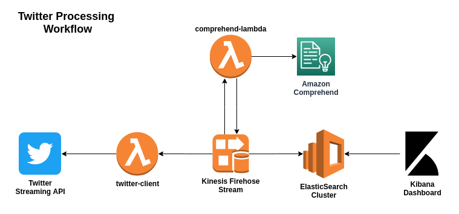
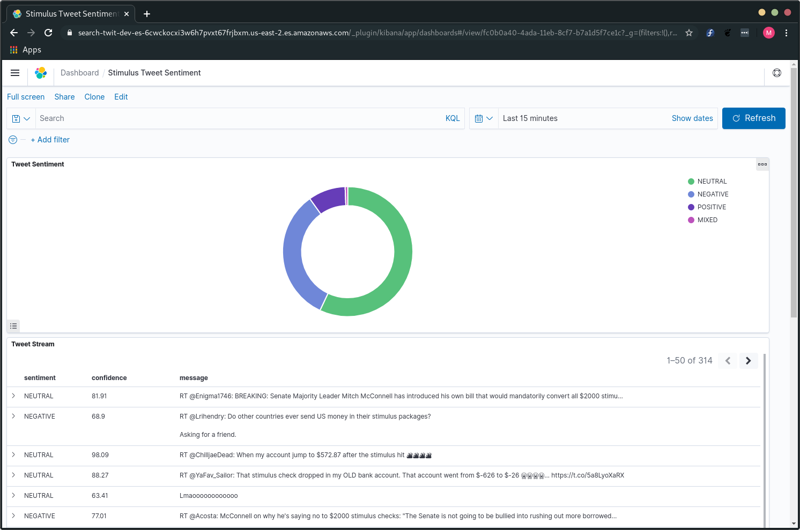

# twitter-processing-w-aws-example

## Disclaimer

**<span style="color:red">!!!!!!!!USE AT YOUR OWN RISK!!!!!!!!</span>**

This repository is provided as-is for educational/demo purposes only. It is not production ready and I take no responsibility for anything that may happen from others use of it. Deploying this code will cause your AWS account to be charged for services used.

## Summary

This is a demo of how you can utilize various AWS services to ingest, analyze, store, and visualize a stream of data. Below is the scenario used:

> I want to determine what the general sentiment is of Tweets related to the current stimulus discussions.

To do this, I utilized the Twitter streaming API and AWS Kinesis Firehose service to ingest Tweets that contain the word **stimulus** in them. To get guess the sentiment of each of the Tweets I added a Lambda function in the Firehose stream that calls out to the Amazon Comprehend service which will give me back a sentiment and confidence level of that determination. We then feed the resulting data into ElasticSearch where we can then setup dashboards to visualize the data.

Below is a diagram of the workflow:



Once we are all done, we will have a dashboard that displays the number of Tweets based on their detected sentiment.



## Layout

This repository contains the following structure.

**apps** - Contains the source code for the Lambda functions we will deploy.

**images** - Contains the images and source for the diagrams/images in this README.

**kibana** - Contains the file that will be used to import into the Kibana UI to create the dashboard and index pattern.

**terraform** - Contains all the Terraform code for deploying the solution to AWS. Is further broken down by app and infrastructure components.

## Requirements

You will need the following pieces of software to make the code in this repository work.

* Terraform >= 0.13.5
* Terragrunt >= 0.26.7
* awscli >= 1.18.28
* Python >= 3.7
* [Sops](https://github.com/mozilla/sops) >= 3.5 (If you want to encrypt your `terraform.tfvars.json` files)
* Twitter API Keys 

## Assumptions

### Knowledge

If you are using this repository, I assume that you have a base understanding of how to use the various tools utilized which are outlined in the **Requirements** section. Downloading, installing, and configuring these tools aside from what I've set up for this demo is outside the scope of this project and will need to be researched on your own.

### AWS Authentication and Profile

The code in this repository assumes you have your awscli configured to use profiles as documented at https://docs.aws.amazon.com/cli/latest/userguide/cli-configure-files.html. It will assume that you are using the `default` profile. If you wish to use another profile, update your `AWS_PROFILE` environment variable with the profile you wish to use.

```
export AWS_PROFILE=<other profile>
```

### Twitter API Keys

This repository assumes that you already have a Twitter developer account and have created an app for use with this demo. If you have not done this, you can get started at https://apps.twitter.com/.

### Security

In this demo, I assume you are running command as an IAM user or roll that has administrator privileges. While I'm sure this can be ran with much less, I did not attempt to figure all that out. I also assume that you are okay with your ElasticSearch cluster being exposed to the internet and wide open while testing (one of the reasons for the disclaimer!!!). It is possible to restrict access via IP by overriding the `allowed_cidr_blocks` Terraform variable in the `terraform/aws/infra/elasticsearch` module if this is a major concern for you. 

## Usage

To deploy this example, you will need to follow the below process.

### Input Your Twitter API Keys

In order for this all to work you need to provide your Twiter API keys so that the client can connect to the API. This is done utilizing the Amazon SSM Parameter Store service but don't worry we're going to let Terraform deploy those for us. What you need to do is make a copy of the example `terraform.tfvars.json` in `terraform/aws/apps/twitter-client` and put in your values. Once that is done you'll encrypt the file in order to keep your keys safe.

```
cd terraform/aws/apps/twitter-client
cp terraform.tfvars.json.example terraform.tfvars.json

# Update your values in vi and the exit
vi terraform.tfvars.json

# Encrypt your file with sops
sops -e -i terraform.tfvars.json
```
> **NOTE:** You will need to update `.sops.yaml` with your own sops configuration and keys. View their documentation on how to do this.

If you do not wish to setup sops to encrypt your sensitive data, you can leave the `terraform.tfvars.json` file unencrypted but you'll need to make a change to the Terragrunt configuration located at `terraform/aws/app/twitter-client/terragrunt.hcl`. You'll have to edit the file and remove the below section from the from the file while leaving everything else in tact.

```
terraform {
  before_hook "before_hook" {
    commands     = ["apply", "plan", "destroy"]
    execute      = ["sops", "-d", "-i", "terraform.tfvars.json"]
  }

  after_hook "after_hook" {
    commands     = ["apply", "plan", "destroy"]
    execute      = ["sops", "-e", "-i", "terraform.tfvars.json"]
    run_on_error = true
  }
}
```

### Run Initial Setup

The initial setup consists of setting up the S3 bucket and DynamoDB table for storing our Terraform state files to do this, we'll let Terragrunt setup these resources with its built in features and then we'll import the resources into Terraform so we can easily delete these items later when we are doing experimenting.

```
cd terraform/aws/setup
terragrunt apply
```

At the prompt, respond with `y` for Terragrunt to create your remote state bucket. When it asks for confirmation to apply the Terraform plan, respond with `no` otherwise you will get errors as the resource already exists. We need to import the resources into our Terraform code.

```
terragrunt import aws_s3_bucket.terraform_state <your amazon account id>-twit-tfstate
terragrunt import aws_dynamodb_table.terraform_locks <your amazon account id>-twit-tflocks
```

> **NOTE:** The reason we have to do this is because we're trying to manage the S3 bucket for state after we let Terragrunt create it and it creates a chicken or the egg scenario. The alternative is to comment out part of the Terragrunt config and use local storage for state and then uncomment the configuration and let Terraform migrate the state to the bucket.

Now that you've successfully imported the resources, rerun the `apply` and accept the prompt.

```
terragrunt apply
```

Setting up your state bucket and locks and being able to easily remove them is now complete.

### Deploy Solution

Now that the setup is out of the way you are ready to deploy the solution. To do this you can easily let Terragrunt do it for you with one command.

```
cd terraform/aws
terragrunt apply-all --exclude-dir .
```

### Invoke Twitter Client Lambda

Now that the solution is deployed it's time to ingest some Tweets. To do this we will invoke the Twitter client Lambda we created in the previous step which will ingest Tweets for 10 seconds before ending. To do this run the following command.

```
aws lambda invoke --function-name twitter-client --payload "{}" output.log
```

> **NOTE:** Since this is just a demo, I didn't want to ingest a lot of data and potentially burn a hole in my wallet. This is why the twitter-client is deployed as a Lambda that we invoke here. This Lambda is setup to only ingest Tweets for 10 seconds at a time. If you wish to ingest more Tweets or for a longer period of time, either invoke the Lambda more or you can run the `apps/twitter-client/twitter-client-no-stop.py` script locally (preferrably with a Python virtual environment).

### Viewing The Data

At this point you should now have some data in ElasticSearch to view. To do this, you need the Kibana endpoint URL which you can get with the below command.

```
cd terraform/aws/infra/elasticsearch
echo "https://$(terragrunt output kibana_endpoint 2>/dev/null)"
```

Open this URL in a web browser to bring up the Kibana UI. Once you are in the UI, you want to follow the following steps to create the dashboard and needed objects.

1. Open the side menu and go to `Stack Management`.
2. Once in `Stack Management`, click on `Saved Objects` on the left hand side.
3. Click `Import` in the top right corner.
4. Click the import box and select the `kibana-export.ndjson` in this repository's **kibana** directory or drag and drop the file into the import box.
5. Once the file is selected, click the `Import` button at the bottom of the screen.
6. You should get an "Import Successful" message at which point you can click the `Done` button.

To view the newly imported dashboard, open the menu in the top left corner and select `Home`. Once on the home page click on `Dashbaord`. On the dashboards page you should see a dashboard called `Stimulus Tweet Sentiment` which you want to click. You should be presented with a pie chart with a widget below it that displays the messages along with the detected sentiment and confidence percentage.

## Cleanup

To cleanup the demo all you need to do is run the `destroy` command which can be accomplished with Terragrunt.

```
# Destroy infrastructure items first
cd terraform/aws/infra
terragrunt destroy-all

# Destroy apps next
cd ../apps
terragrunt destroy-all

# Then destroy your state bucket and table via setup
cd ../setup
terragrunt destroy
```

> **NOTE:** The last command will fail with an error because Terraform will try to save its state to the bucket you just destroyed. This is okay and expected.